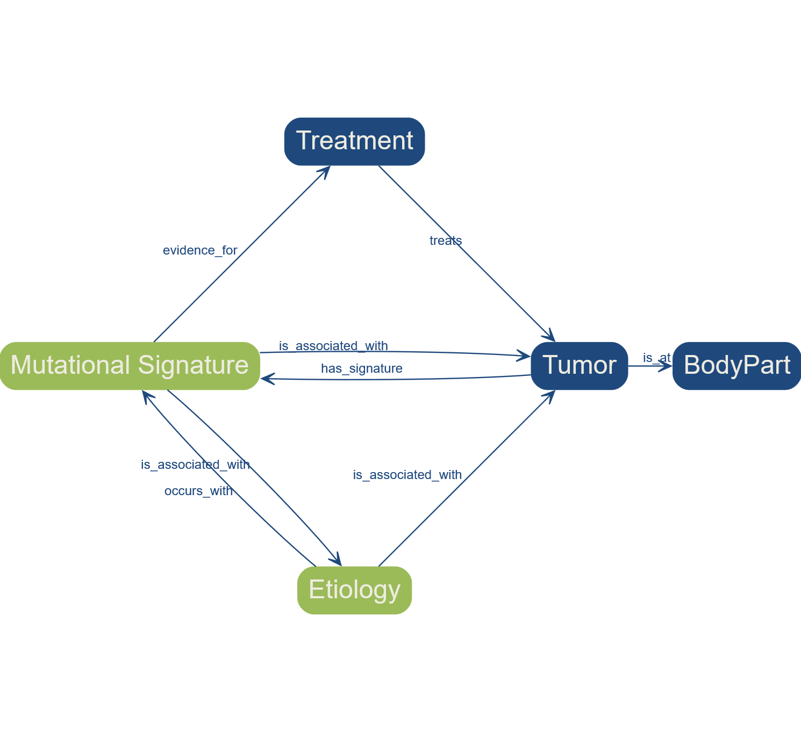

# Mutational Signatures Ontology

## Background

This project documents a knowledge graph and ontology about the domain of mutational signatures. 

Mutational Signatures are generated from somatic genomic mutation data based on their sequence context and have been shown to be indicative of various functional changes in cancer patients. 

The Mutational Signature Ontology and Knowledge Graph represents the numeric data of the different signature types according to the COSMIC database in version 3.4 [^sondka2023] and selected metadata like their signature type. It can also accommodate mutational signature types from other sources. It is implemented as an owl/rdf knowledge graph, also encoding necessary other information regarding the sample used, and other features encoded in the COSMIC dataset, such as associated etiologies, and related literature. 

Because of this, another source of knowledge that we integrated are the discoveries based on Alexandrov et al. [^alexandrov2020], which provide a quantificational link between cancer types and mutational signatures. The tumor, etiology, and treatment classes of the Mutational Signature Ontology have been designed to be interoperable with the National Cancer Institute Thesaurus (NCIT), which will allow for the federation of data from various sources. The Mutational Signature Ontology models relations between mutational signatures, mutations, and localities in the genomic location, which uses concepts from the Gene Ontology [^ashburner2000] and Sequence Ontology [^eilbeck2005] and NCIT [^ncit2024]. The Mutational Signature Ontology is used as a tool for knowledge management, allowing effective information retrieval and integrating a diverse range of sources.

***Figure 1:** Overview of a part of the ontology.*

### Ontology

The ontology and the populated knowledge graph is given in `ontology/`

### Documentation and reports

Find a relevant report and a poster about the topic in `docs/`

## References

[^alexandrov2020]: Alexandrov, L. B., Kim, J., Haradhvala, N. J., Huang, M. N., Tian Ng, A. W., Wu, Y., Boot, A., Covington, K. R., Gordenin, D. A., Bergstrom, E. N. et al. (2020). The repertoire of mutational signatures in human cancer. *Nature*, 578(7793), 94–101.
[^ashburner2000]: Ashburner, M., Ball, C. A., Blake, J. A., Botstein, D., Butler, H., Cherry, J. M., Davis, A. P., Dolinski, K., Dwight, S. S., Eppig, J. T., Harris, M. A., Hill, D. P., Issel-Tarver, L., Kasarskis, A., Lewis, S., Matese, J. C., Richardson, J. E., Ringwald, M., Rubin, G. M. and Sherlock, G. (2000). Gene ontology: tool for the unification of biology. *Nature Genetics*, 25(1), 25–29.
[^degasperi2020]: Degasperi, A., Amarante, T. D., Czarnecki, J., Shooter, S., Zou, X., Glodzik, D., Morganella, S., Nanda, A. S., Badja, C., Koh, G., Momen, S. E., Georgakopoulos-Soares, I., Dias, J. M. L., Young, J., Memari, Y., Davies, H. and Nik-Zainal, S. (2020). A practical framework and online tool for mutational signature analyses show intertissue variation and driver dependencies. *Nature Cancer*, 1(2), 249–263.
[^eilbeck2005]: Eilbeck, K., Lewis, S. E., Mungall, C. J., Yandell, M., Stein, L., Durbin, R. and Ashburner, M. (2005). The sequence ontology: a tool for the unification of genome annotations. *Genome Biology*, 6(5).
[^ncit2024]: National Cancer Institute Thesaurus (NCIT) (2024). Version 24.01e. https://ncit.nci.nih.gov/
[^sondka2023]: Sondka, Z., Dhir, N. B., Carvalho-Silva, D., Jupe, S., Madhumita, McLaren, K., Starkey, M., Ward, S., Wilding, J., Ahmed, M., Argasinska, J., Beare, D., Chawla, M. S., Duke, S., Fasanella, I., Neogi, A. G., Haller, S., Hetenyi, B., Hodges, L., Holmes, A., Lyne, R., Maurel, T., Nair, S., Pedro, H., Sangrador-Vegas, A., Schuilenburg, H., Sheard, Z., Yong, S. and Teague, J. (2023). Cosmic: a curated database of somatic variants and clinical data for cancer. *Nucleic Acids Research*, 52(D1), D1210–D1217.
[^vanhoeck2019]: Van Hoeck, A., Tjoonk, N. H., van Boxtel, R. and Cuppen, E. (2019). Portrait of a cancer: mutational signature analyses for cancer diagnostics. *BMC Cancer*, 19(1).

